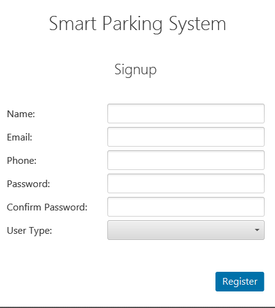
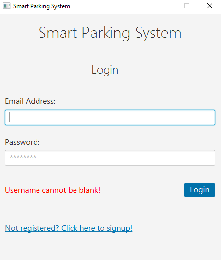
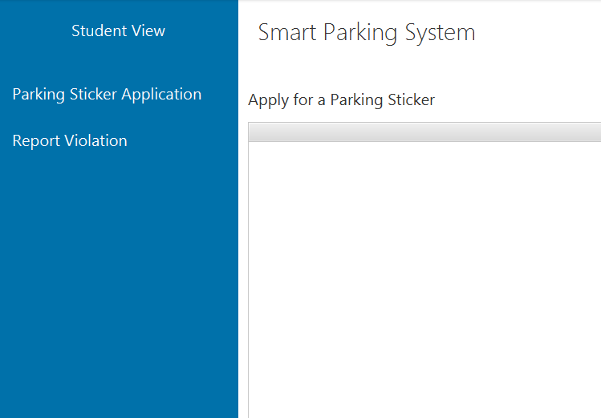
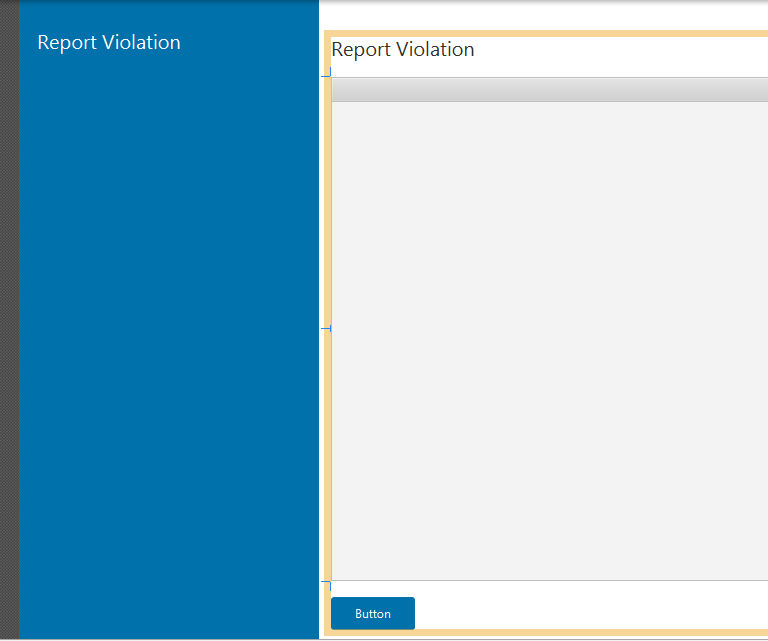
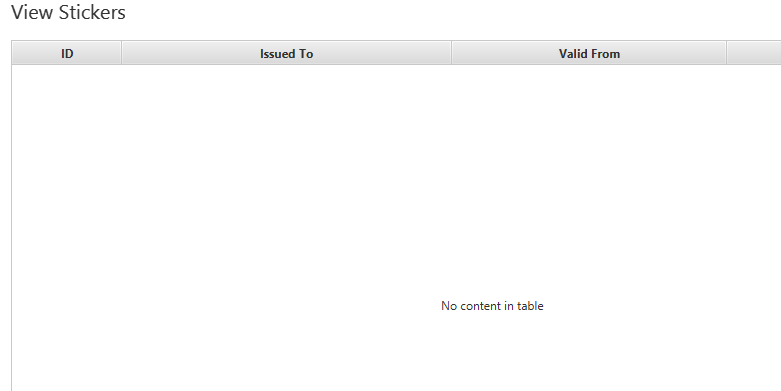
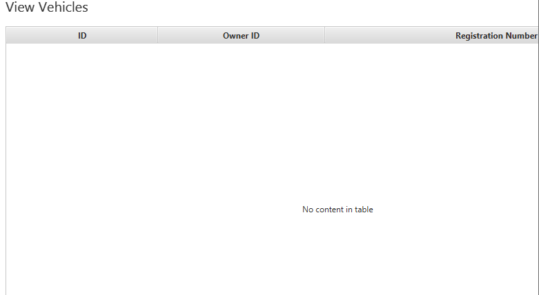
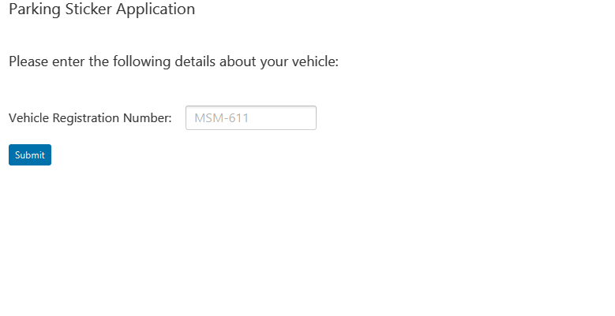

# Java-based-Smart-Parking-System
An online parking system for University where users can be Staff members and student both. This system will help them to find best suitable place for parking without wasting time in crowded area.

## Description
For this particular project we used different tools and technologies. Further details are as follows:
- **1:** We used core functionalities of Object Oriented Java along with JavaFX
- **2:** The layouts and User Interfaces were generated in SceneBuilder using JavaFX
- **3:** For backend and exception handling we used java and its additional feature like exception handling and junit
- **4:** For database we used MySQL to perform CRUD Operations on the data which is stored in database. You can use any other database as well e.g. Oracle

## Screenshots

SignUp

    

Login

    

Student View

    

Report Violation

    

View Stickers

    

View Vehicles

    

Parking Sticker Application

    

